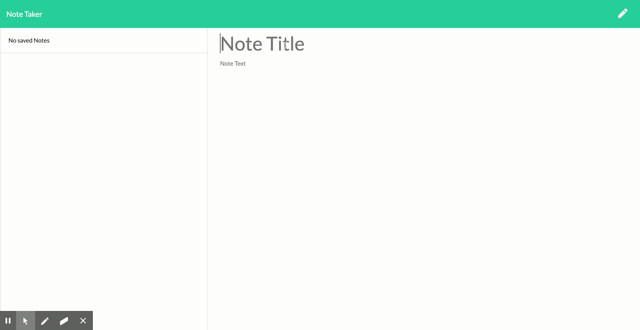
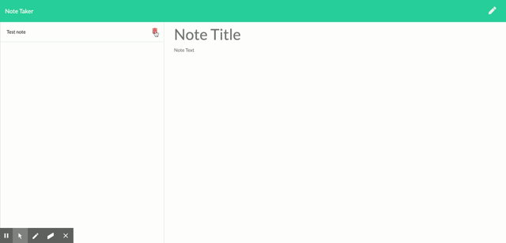

# NOTE TAKER
  For this project the objective was to make a note taker using express for the server.
  I used "fs" to do all of the file saving
  I used "path" for all of the pathing

# SCREEN SHOTS

# INSTALLATION
  Please clone this repo 
  Please do a npm install to install the required node modules

# NODE MODULES
  express

